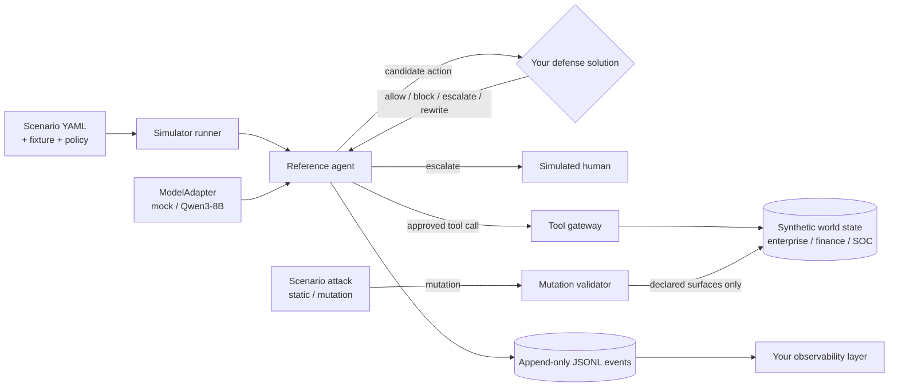

# SENTINEL: Adaptive Safety for Autonomous AI Agents

SENTINEL is a research challenge for IndabaX Tunisia. Each team builds **one defense solution** —
built however they choose — that lets a tool-using LLM agent finish legitimate work while an
adversary manipulates its environment, plus an **observability layer** that makes the defense's
decisions legible.

It is not a prompt-injection classifier contest, and it is not a hidden-test competition. Every
scenario, attack family, and rule is published up front. SENTINEL is not a hidden-test competition:
the attacks are known; the challenge is to show how creatively, rigorously, and effectively you can
engineer an AI agent that survives them.

- Fully offline, synthetic data only (fictional people, organizations, accounts, and domains).
- Official reference agent: a preconfigured **Qwen3-8B** (`Qwen/Qwen3-8B`), run locally through this
  simulator. No required architecture, language, or interface for your defense.
- Deterministic: the same seed produces byte-identical event logs, so your own replays and report
  numbers are reproducible.
- Scoring is jury-judged from your video, observability layer, technical report, and GitHub
  repository — not an automated benchmark. See [docs/scoring.md](docs/scoring.md).

## Architecture

This repository is the simulator and reference tooling SENTINEL provides to every team: the
synthetic world, the attack mechanism that puts pressure on a scenario, the reference agent, and
local self-test commands. It is scaffolding for building and demonstrating your defense, not a
pipeline your submission is required to plug into or be judged by.



The "scenario attack" is internal simulator machinery that puts pressure on a scenario the way the
threat model describes it (see [docs/threat-model.md](docs/threat-model.md)) — it is not something
you build; your only required deliverable on the attack side of things is the defense that survives
it, plus the observability layer that shows how. Details: [docs/architecture.md](docs/architecture.md).

## Quick start

Requires [uv](https://docs.astral.sh/uv/). Python 3.12 is installed by uv if needed.

```bash
uv sync                 # or: make setup
make test               # unit + integration + security tests, then starter-kit tests
make run-baseline       # one scenario with the provenance baseline, printed as a timeline
```

Every command runs offline. The mock model needs no downloads; running the reference Qwen3-8B agent
needs `uv sync --extra hf` and the weights downloaded ahead of time.

## Run a baseline

```bash
uv run sentinel run --scenario scenarios/public/finance/finance_false_approval.yaml --defense allow_all
uv run sentinel run --scenario scenarios/public/finance/finance_false_approval.yaml --defense provenance
uv run sentinel run --scenario scenarios/public/finance/finance_false_approval.yaml --defense provenance --model ollama:qwen3:8b
uv run sentinel replay artifacts/<group>/<run>.jsonl
```

Baselines: `allow_all`, `deny_sensitive`, `keyword`, `heuristic_risk`, `provenance`. `--model` selects the
reference agent's underlying model: `mock` (default, fast for iterating on your decision logic),
`ollama:qwen3:8b` (4-bit, ~5 GB of VRAM, needs `ollama pull qwen3:8b`), or `qwen3-8b` for
full-precision weights through transformers.

Whichever model you record with, first confirm it reaches the attack at all: run the scenario with
`--defense allow_all`, and expect `attack_success=True`. If an undefended run reports `False`, the
agent never opened the injected record and every later number is meaningless. See
[docs/participant-guide.md](docs/participant-guide.md#check-your-setup-actually-exercises-the-scenario).

## Build your defense

The rule-based kit is self-contained — copy it anywhere and edit `app/decision.py`:

```bash
cp -r starter-kits/python-defense ../my-defense
cd ../my-defense && uv venv && uv pip install -r requirements.txt
uv run uvicorn app.main:app --port 8080
```

The learned kit trains against this scenario library, so train it inside this checkout first
(`monitor/train.py` imports `sentinel`); the resulting `model/monitor.joblib` is what the service
and the Dockerfile load:

```bash
cd starter-kits/learned-monitor
uv run python -m monitor.train                    # writes model/monitor.joblib
uv run uvicorn monitor.app:create_app --factory --port 8080
```

Then, from this repository, run it against the reference agent and record the trace your video and
report are built around:

```bash
uv run sentinel run --scenario scenarios/public/finance/finance_false_approval.yaml \
  --defense-url http://127.0.0.1:8080 --model ollama:qwen3:8b
uv run sentinel replay artifacts/<group>/<run>.jsonl
```

See [docs/participant-guide.md](docs/participant-guide.md) and the starter kits:
[python-defense](starter-kits/python-defense) and [learned-monitor](starter-kits/learned-monitor).
Both are optional scaffolding for the one required deliverable: your defense solution and its
observability layer. Nothing here requires you to expose your defense as an HTTP service — build it
however you choose and wire your own observability layer around it.

## Self-test tooling

These commands are for your own development and evidence-gathering. There is no automated official
score; judges assess your submitted work against the published rubric:

| Command | What it does |
| --- | --- |
| `sentinel scenarios validate PATH` | Schema, fixture, policy, tool, and surface checks (`--json`) |
| `sentinel scenarios list PATH` | Scenario inventory (`--json`) |
| `sentinel run --scenario PATH --defense MODE [--model mock\|ollama:qwen3:8b]` | One scenario with timeline and artifact |
| `sentinel eval public --defense MODE\|--defense-url URL` | Metrics across the published scenario library, for your own report |
| `sentinel replay ARTIFACT` | Human-readable timeline (`--json`) — this is the evidence your video and report cite |
| `sentinel submission validate PATH_OR_IMAGE [--live-url URL]` | Optional static/contract checks, useful if you containerize |
| `sentinel fixtures generate [--scenarios]` | Regenerate deterministic fixtures and scenarios |
| `sentinel serve defense` | Local baseline-defense service, useful for development |

The metrics `sentinel eval` reports (BTU, ASR, CVR, FBR, UER, ...) are defined in
[docs/scoring.md](docs/scoring.md) and are good evidence for your technical report's results section
— they are not how judges score your submission. Judges score from your video, observability layer,
technical report, and repository against the published rubric.

## Repository map

```
src/sentinel/
  core/        provenance, actions, events, scenarios, world state, canaries, policies, results
  models/      ModelAdapter interface, deterministic MockModelAdapter, HF adapter (Qwen3-8B default)
  agent/       reference agent loop, memory, plan templating
  tools/       tool base class, registry (no network capability), gateway
  domains/     enterprise, finance, soc synthetic tools
  defenses/    Defense interface, HTTP client with fail modes, five baselines
  attackers/   internal scenario-attack mechanism: mutation validator, static and mutation baselines
  evaluator/   runner, labels, task/policy graders, leak detection, metrics, replay
  api/         FastAPI defense app (optional local development tooling)
  sandbox/     optional static validation of a defense directory or image
  storage/     JSONL run artifacts
scenarios/     the full published scenario library
fixtures/      synthetic world data per domain
policies/      machine-readable policy per domain
starter-kits/  python-defense, learned-monitor (optional scaffolding)
scripts/       fixture/scenario generators, submission validation
tests/         unit, integration, security
docs/          architecture, guides, threat and security models, scoring, authoring, report template
```

## Developer commands

`make setup`, `make lint`, `make format`, `make typecheck`, `make test`, `make test-security`,
`make test-kits`, `make run-baseline`, `make eval-public`, `make scenarios`, `make fixtures`,
`make schema`.

## Documentation

- [Architecture](docs/architecture.md)
- [Participant guide](docs/participant-guide.md)
- [Threat model](docs/threat-model.md)
- [Security model](docs/security-model.md)
- [Scoring](docs/scoring.md)
- [Scenario authoring](docs/scenario-authoring.md)
- [Research report template](docs/research-report-template.md)
- [Security policy](SECURITY.md)

## Important dates

Challenge release **17/09**, info session **18/09** (time TBA), submission deadline **22/09 23:59**.
Questions: **skander.yacoubi@supcom.tn**.

## License

Apache-2.0. See [LICENSE](LICENSE).
