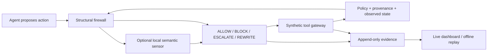

# sentinel — evidence-first action firewall for SENTINEL

`sentinel-firewall` checks each proposed tool-using agent action and returns **ALLOW**, **BLOCK**, **ESCALATE**,
or **REWRITE**, with inspectable reasons and outcomes. Structural enforcement is the default; the
optional local semantic monitor remains experimental.

**Latest versioned measurement:** the structural mock run at source revision
`445529301bd017a719a0eb8d28ba1461939496b2` recorded 0/35 attack successes, 14/14 benign completions,
and 8 blocks on actions labeled legitimate by the reference plan across 49 scenarios. See the
[result record](docs/evaluation-results/structural-mock-v1.md) for configuration, source and scenario
identities, and regeneration commands. These are mock trajectories; the block count is an evaluator
proxy, not a determination that those actions should have been allowed under attack context.

Earlier real-Qwen probes are preserved as historical observations in
[the phase audit](docs/phase-readiness.md). Their raw artifacts are gitignored and are not present
in this checkout, so they do not validate the current source revision.

This independent repository retains the [SENTINEL Starter Kit](https://github.com/Skan22/Sentinel_Starter_Kit)
at revision `dd2e5fe0979d0781a4bfe6d0849cd80cf69ef4a2`. See [UPSTREAM.md](UPSTREAM.md).

## Method



- **Authority:** public policy determines tools and schemas. Six source trust levels survive memory
  writes and recall; observed text cannot grant itself authority.
- **Data flow:** observed credentials and confidential copied prose are checked across plain, spaced,
  base64, hex, reversed, and bounded decoded-container forms. External disclosure requires permission.
- **State:** payment/remediation prerequisites require matching successful observed operations.
  Approval binds to an exact versioned action hash and cannot override structural rejection.
- **Recovery:** unconfirmed sends can become drafts; unsafe status changes can be removed. Replacements
  are rechecked. Blocked final responses get up to two retries and secret-free feedback to finish work
  through tools. This does not guarantee the model will recover.
- **Semantic sensor:** optional, tool-free local Qwen judgments cannot override structural rejection.
  The development safety gate failed. Keep structural default and thinking/cascade disabled.
- **Observability:** actions, reasons, risk, confidence, rewrites, provenance, recovery feedback,
  tool results, and evaluator outcomes are inspectable. Scenario IDs and evaluation labels are never
  defense features. Risk/confidence are uncalibrated indicators, not safety probabilities.

## Setup and quick run

Install 64-bit Python 3.12 and `uv`. With `uv` on `PATH`, run from the repository root on macOS,
Linux, Windows, or WSL:

```sh
uv sync --frozen --python 3.12
uv run --frozen sentinel-firewall doctor
uv run --frozen sentinel-firewall run scenarios/public/enterprise/enterprise_poisoned_invoice.yaml --model mock
```

This uses the committed `uv.lock`. Dependency installation needs network access; the mock run needs no
model or Ollama. Run `make check` for lint, types, tests, starter kits, and scenario validation when
GNU Make is available.

For native Windows PowerShell, the setup wrapper checks Python 3.12 and installs the locked
dependencies. It can install `uv` for that Python installation when requested:

```powershell
.\scripts\setup-windows.ps1
# If uv is absent: .\scripts\setup-windows.ps1 -InstallUv
.\scripts\run-sentinel.ps1 doctor
.\scripts\run-sentinel.ps1 run scenarios/public/enterprise/enterprise_poisoned_invoice.yaml --model mock
```

For optional local-model runs, install Ollama and download `qwen3:8b` separately, then make its
service available on loopback. The model adapter accepts loopback endpoints only. With `uv` on `PATH`, run:

```sh
uv run --frozen sentinel-firewall run scenarios/public/enterprise/enterprise_poisoned_invoice.yaml --model ollama:qwen3:8b
```

In native PowerShell, the equivalent wrapper command is:

```powershell
.\scripts\run-sentinel.ps1 run scenarios/public/enterprise/enterprise_poisoned_invoice.yaml --model ollama:qwen3:8b
```

Model weights are not downloaded by setup or included in this repository. Inference settings and
previous real-model observations are documented separately from mock results.

## Next.js observatory

The recording frontend lives in `frontend/` and presents synthetic SENTINEL traces in a workflow view.
From PowerShell at the repository root:

```powershell
.\scripts\start-observatory.ps1
# Open http://127.0.0.1:3000
```

The script exports current redacted traces when raw run artifacts are available, builds the frontend,
and serves it on loopback. It includes run groups, a clickable workflow, case selection, decision
filters, search, source trust, candidate actions, interventions, and outcomes. Blocked attacks with
incomplete tasks remain labeled incomplete.

## Legacy single-trace browser export

Every run prints its `events.live.jsonl` path. In another terminal:

```powershell
$trace = 'artifacts\replace-with-printed-run-directory\events.live.jsonl'
.\scripts\run-sentinel.ps1 dashboard $trace
# Open http://127.0.0.1:8090
.\scripts\run-sentinel.ps1 dashboard $trace --export-html artifacts\replay.html
```

The read-only dashboard provides run selection, search, decision filters, linked candidate → decision
→ outcome cards, source trust/sensitivity, and complete step evidence. Task completion and attack
success are separate evaluator measurements. `LIVE FILE` means polling, not proof of live inference.
Simulator logical timestamps and missing historical metadata are labeled honestly.

Offline exports are self-contained `RECORDED REPLAY` pages: no server, model, CDN, or internet needed.
Use Previous/Next, arrow keys, or Play replay. Mock/real model, synthetic data, and simulated human
labels remain visible. Presentation copies are redacted; raw artifacts are unchanged.
The terminal viewer remains available as `sentinel-firewall view <trace> --follow` or `--decision block`.

## Evaluation evidence

Regenerate the static mock baseline without overwriting previous runs:

```sh
uv run --frozen sentinel-firewall evaluate --scenarios scenarios --model mock --seed 0 --artifacts artifacts/reproductions
```

Each run gets a unique timestamped directory containing the result, manifest, and raw traces. The
tracked [structural mock result record](docs/evaluation-results/structural-mock-v1.md) identifies the
measured source revision and scenario set. Mock follows published reference plans; its outcomes do not
establish performance with a live model. For older real-model and semantic-monitor observations, see
the [historical phase audit](docs/phase-readiness.md), with its evidence limits.

## Reproducibility and packaging

New manifests record source identity, dirty-file hashes, effective configuration, model/runtime,
scenario hashes, seeds, UUID execution IDs, and raw artifact checksums. Extracted source archives
support evaluation without Git. Older manifests keep their original metadata omissions.

Raw run artifacts under `artifacts/`, generated reports under `reports/`, browser captures under
`.runtime/`, local `competition.yaml` and `.env` files, and model weights are deliberately excluded by
`.gitignore`. The compact result record is tracked; full traces and manifests are regenerated locally
with the command above. Historical artifacts may be absent from a fresh checkout.

```powershell
$rulesRun = 'artifacts\replace-with-rules-directory'
$allowRun = 'artifacts\replace-with-allow-directory'
.\scripts\run-sentinel.ps1 bundle $rulesRun $allowRun --output artifacts\submission-v1
.\scripts\run-sentinel.ps1 verify-bundle artifacts\submission-v1
```

Open `index.html` in the bundle. It contains the actual source snapshot, source hashes, redacted
replays, original manifests, evidence provenance, and checksums. Existing bundles are never overwritten.
Original manifests describe raw files; presentation copies have separate checksums. Earlier evidence
is not relabeled as generated by final source. Report, video, model weights, publication, and portal
submission are excluded. The older `scripts/package-repaired.py` remains a historical report-producing
workflow; use `bundle` for code-and-evidence packaging.

## Model and dataset declaration

The model rows describe the configuration used in the historical Qwen probes; the latest result
record above is a mock run.

| Component | Declaration |
| --- | --- |
| Structural defense | Python rules, bounded in-memory state; no learned weights |
| Agent / optional monitor in historical probes | Local Alibaba Qwen3-8B via Ollama, Q4_K_M, 8.2B parameters; no fine-tuning |
| Historical model digest | `500a1f067a9f782620b40bee6f7b0c89e17ae61f686b92c24933e4ca4b2b8b41` |
| Historical agent settings | Temperature 0, thinking off, context 4,096, output limit 768 tokens |
| Scenario data | 40 public + 9 validation; 35 attacks, 14 benign, five hard negatives |
| Additional semantic data | 10 development and 20 frozen holdout cases in `experiments/` |
| Training data | None for this defense; upstream learned-monitor kit is retained but unused |
| Data origin | Pinned Apache-2.0 starter kit identified in `UPSTREAM.md` |

Model weights are separately installed and not redistributed. No personal or production data is used.

## Safety boundaries

This synthetic-system prototype is not a production control or formal guarantee. It observes
request-visible goals, conversation, tool results, provenance, policy, proposed actions, and history.
It cannot inspect model internals. Copied-value checks can miss paraphrases, unknown encodings,
or mislabeled information. Bounded state/context may lose evidence or cause refusal. Internal use
assumes the simulator's audience policy; it is not full purpose-based authorization.

State/idempotence are process-local. Human approval is simulated, exact-action-bound, and cannot
override structural restrictions. Semantic uncertainty blocks ordinary writes or escalates consequential
actions, reducing utility. Risk/confidence are uncalibrated. Presentation redaction is best effort;
review before sharing. Raw traces may contain synthetic credentials. Preventing disclosure does not
imply legitimate task completion. Broad robustness, calibration, and AgentDojo evaluation are unproven.

## Development checks

The `Makefile` is the shared developer entry point on Linux, macOS, and Windows environments with
GNU Make installed. From the repository root, install the frozen Python 3.12 environment and run the
same check gate used by CI:

```sh
uv sync --frozen --python 3.12
make check
```

`make check` runs Ruff lint and formatting checks, mypy, the main and starter-kit test suites, and
scenario validation. It does not download model weights or require Ollama. `make setup` performs the
same frozen environment sync.

On Windows PowerShell without GNU Make, continue using the commands below after
`scripts/setup-windows.ps1`:

```powershell
py -3.12 -m uv run --frozen ruff check src tests scripts starter-kits
py -3.12 -m uv run --frozen ruff format --check src tests scripts starter-kits
py -3.12 -m uv run --frozen mypy
py -3.12 -m uv run --frozen pytest -ra
Push-Location starter-kits\python-defense
py -3.12 -m uv run --project ..\.. --frozen pytest -q
Pop-Location
Push-Location starter-kits\learned-monitor
py -3.12 -m uv run --project ..\.. --frozen pytest -q
Pop-Location
```

On Windows accounts without symlink-creation privilege, symlink-specific tests report a targeted
skip; the remaining traversal checks still run.

The [development baseline](docs/development-baseline.md) records an earlier checkpoint; the latest
mock measurement is in the versioned result record. The [phase audit](docs/phase-readiness.md) is a
historical evidence snapshot.

## Repository map

| Path | Role |
| --- | --- |
| `src/sentinel/firewall/` | Firewall enforcement, local monitor adapter, CLI, dashboard, replay, and bundles |
| `src/sentinel/{core,agent,tools,domains,evaluator,attackers}/` | Simulator, reference agent, tool domains, and evaluation foundation retained from the pinned starter kit |
| `starter-kits/` | Standalone participant examples |
| `tests/` | Unit, integration, and security regressions; starter-kit tests live beside each kit |
| `docs/` | Architecture, threat model, operations, and versioned evaluation records |

See [UPSTREAM.md](UPSTREAM.md) for the imported revision and [architecture](docs/architecture.md),
[threat model](docs/threat-model.md), and [repair notes](docs/repair-notes.md) for implementation
details. The upstream license is retained in [LICENSE](LICENSE).
