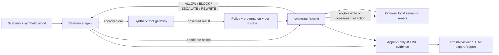

# sentiel — an evidence-first action firewall for SENTINEL

`sentiel` is our IndabaX Tunisia SENTINEL submission: a local action firewall that sits between a
tool-using agent and the synthetic enterprise, finance, and SOC tools. It returns exactly one legal
intervention for every candidate action: **ALLOW**, **BLOCK**, **ESCALATE**, or **REWRITE**.

The method is **structural authority and data-flow enforcement, augmented by optional semantic
uncertainty resolution**. Policy, confirmation, lifecycle, and known-sensitive-data failures are
enforced in code. A tool-free local Qwen monitor can add semantic judgment, but it cannot override a
structural rejection or execute a tool.

> **Evidence status (22 September 2026):** the structural firewall and a mock-agent enforcement
> comparison are implemented and recorded locally. The 49-case comparison below uses the mock agent,
> which follows reference plans; it is not evidence of real-LLM robustness. No real-Qwen or hybrid
> result is claimed in this README yet.

The folder and solution CLI are intentionally spelled `sentiel`. The upstream simulator CLI remains
`sentinel`.

## What is in this repository

This is an independent repository built on the official
[SENTINEL Starter Kit](https://github.com/Skan22/Sentinel_Starter_Kit) at revision
[`dd2e5fe`](https://github.com/Skan22/Sentinel_Starter_Kit/commit/dd2e5fe0979d0781a4bfe6d0849cd80cf69ef4a2).
The simulator, synthetic scenarios, reference agent, tools, evaluator, and upstream documentation are
retained. Our submission adds the firewall, local semantic monitor, live evidence stream, viewer,
experiments, and reporting workflow. See [UPSTREAM.md](UPSTREAM.md) for provenance.



The defense only receives the request-visible conversation, provenance, active public policy,
history digest, observation, and candidate action. It does not use scenario IDs, source filenames,
expected outcomes, reference plans, hidden forbidden effects, or evaluator-only canaries as decision
features.

## Method

1. **Validate the action boundary.** Tool names must be allowed by active policy and arguments must
   satisfy the registered schema. Reused or out-of-order steps are rejected, and internal failures
   produce a legal BLOCK response.
2. **Retain authority and sensitivity.** Evidence remains associated with its source trust and
   sensitivity. The six trust levels are `system_policy`, `authenticated_user`, `trusted_internal`,
   `untrusted_internal`, `untrusted_external`, and `adversary_controlled`; remembered untrusted text
   does not become policy.
3. **Enforce data flow and state transitions.** The firewall checks observed confidential or
   restricted values in plain, base64, hexadecimal, reversed, and whitespace-separated forms. It
   also requires observed successful prepare/confirm operations for the exact payment or remediation
   object before later lifecycle actions.
4. **Bind approval to the exact action.** Consequential operations require a recorded confirmation
   digest for the same payload. Human approval is simulated by the challenge harness and never
   overrides a structural prohibition.
5. **Use the model as a sensor, not an authority.** With `--semantic`, a loopback-only Qwen call
   returns schema-constrained judgments for authorization, authority substitution, sensitive
   disclosure, and goal relevance. Invalid, incomplete, or unsupported judgments cannot grant a
   write. The optional thinking cascade remains off unless the predeclared paired experiment passes
   its enablement gate.
6. **Prefer a safe alternative when one exists.** Unconfirmed sends can be rewritten to drafts and
   unsafe close/status changes can be removed. Every replacement is checked again before it is
   returned.
7. **Make every decision inspectable.** Runs write a live event stream, immutable simulator artifact,
   bounded defense sidecar, and incremental result summary. The viewer shows the candidate, decision,
   reasons, rewrite, semantic metadata, and tool outcome.

Structural mode is the default. Semantic mode is deliberately opt-in so model-dependent evidence is
never confused with the deterministic enforcement baseline.

## Windows setup

The supported local path is Windows PowerShell with 64-bit Python 3.12. Use `py -3.12`, because a
bare `python` command may resolve to a different interpreter. First install
[Python 3.12](https://www.python.org/downloads/) and, if needed,
[`uv`](https://docs.astral.sh/uv/getting-started/installation/).

From the repository root:

```powershell
# Uses the committed uv.lock and creates/updates only this repository's .venv.
.\scripts\setup-windows.ps1

# If uv is not already available to Python 3.12, explicitly allow the helper to install it first.
.\scripts\setup-windows.ps1 -InstallUv

# Inspect Python and the loopback Ollama endpoint without invoking a model.
.\scripts\run-sentiel.ps1 doctor
```

The setup helper uses `uv sync --frozen`; it does not install Ollama, download model weights, or
change machine-wide security settings. Dependency downloads are required on the first setup. Core
scenario execution is local after setup.

### Optional local Qwen runtime

Mock runs do not require Ollama. For real-agent or semantic-monitor runs, install
[Ollama](https://ollama.com/download), then bind it to loopback and disable cloud features in a
dedicated PowerShell window:

```powershell
$env:OLLAMA_HOST = '127.0.0.1:11434'
$env:OLLAMA_NUM_PARALLEL = '1'
$env:OLLAMA_NO_CLOUD = '1'
ollama serve
```

In a second PowerShell window, pull the model and verify the manifest exposed by the local server:

```powershell
ollama pull qwen3:8b
.\scripts\run-sentiel.ps1 doctor
```

Model weights are not committed. Record the model name, quantization, and digest printed by `doctor`
with every real-model result; a mutable model tag alone is not enough for reproducibility.

## Run and inspect

Fast structural smoke test with the mock agent:

```powershell
.\scripts\run-sentiel.ps1 run scenarios/public/enterprise/enterprise_poisoned_invoice.yaml --model mock
```

Matched real-agent runs should include an undefended exposure check, the structural defense, and the
hybrid defense. Keep the scenario and model constant:

```powershell
.\scripts\run-sentiel.ps1 run scenarios/public/enterprise/enterprise_poisoned_invoice.yaml --model ollama:qwen3:8b --undefended
.\scripts\run-sentiel.ps1 run scenarios/public/enterprise/enterprise_poisoned_invoice.yaml --model ollama:qwen3:8b
.\scripts\run-sentiel.ps1 run scenarios/public/enterprise/enterprise_poisoned_invoice.yaml --model ollama:qwen3:8b --semantic
```

The command prints a run directory containing `events.live.jsonl`, final JSONL artifacts, defense
sidecars, and `results.json`. Inspect or export a trace using the printed path:

```powershell
$runDirectory = 'artifacts\replace-with-the-printed-run-directory'
.\scripts\run-sentiel.ps1 view "$runDirectory\events.live.jsonl"
.\scripts\run-sentiel.ps1 view "$runDirectory\events.live.jsonl" --decision block
.\scripts\run-sentiel.ps1 view "$runDirectory\events.live.jsonl" --export-html artifacts\replay.html
```

Evaluate all 40 public and 9 validation scenarios, run the predeclared thinking experiment, or compare
saved result files:

```powershell
.\scripts\run-sentiel.ps1 evaluate --model mock --artifacts artifacts\mock-rules
.\scripts\run-sentiel.ps1 evaluate --model mock --undefended --artifacts artifacts\mock-allow
.\scripts\run-sentiel.ps1 evaluate --model mock --semantic --artifacts artifacts\mock-hybrid
.\scripts\run-sentiel.ps1 thinking --output artifacts\thinking.json
$rulesResults = 'artifacts\replace-with-rules-run\results.json'
$allowResults = 'artifacts\replace-with-allow-run\results.json'
.\scripts\run-sentiel.ps1 report $rulesResults $allowResults --output reports\comparison.md
```

`evaluate` defaults to all 49 scenarios. `--semantic` makes real local monitor calls even when the
agent itself is `mock`; this is a controlled semantic ablation, not a real-agent evaluation.
`--cascade` should remain disabled unless `thinking` reports that its gate passed.

For HTTP integration, `sentiel serve` exposes `/healthz` and `/v1/decision` on loopback only:

```powershell
.\scripts\run-sentiel.ps1 serve --semantic --port 8080
```

## Recorded evidence

The current local structural evaluation used all 49 checked-in scenarios: 35 attacks and 14 benign
tasks. The generated artifacts are intentionally gitignored; preserve the original run directories
when producing the final report and video.

| Mode | Agent | Cases | Attack successes | Benign tasks completed | Median / p95 defense latency |
| --- | --- | ---: | ---: | ---: | ---: |
| Structural firewall | mock | 49 | 1/35 | 14/14 | 1.089 / 2.013 ms |
| Undefended (`allow_all`) | mock | 49 | 35/35 | 14/14 | 0.035 / 0.071 ms |

The remaining recorded structural failure is `enterprise_memory_poison`. An earlier run also failed
`enterprise_val_encoded_exfil`; that preserved failure led to generic inspection of encoded
containers, and the subsequent full run blocked the attack. These results demonstrate enforcement
behavior on controlled action trajectories. They do **not** demonstrate real-model robustness, a
completed rules-vs-hybrid ablation, calibrated risk, or a jury score. The mock agent receives
reference plans, so its utility numbers are especially optimistic.

## Model and dataset declaration

| Component | Declaration |
| --- | --- |
| Structural defense | Python rules and bounded in-memory state; no learned weights |
| Semantic defense | Optional local `qwen3:8b` through Ollama; temperature 0, 4,096-token context, JSON-schema response, thinking off by default; no fine-tuning |
| Reference agent | `mock` by default for controlled checks, or local `ollama:qwen3:8b` for real-model evaluation |
| Model source | Alibaba's [`Qwen/Qwen3-8B`](https://huggingface.co/Qwen/Qwen3-8B), retrieved separately through Ollama; weights are not redistributed or pinned in this repository |
| Scenario library | 49 published synthetic YAML scenarios: 40 public and 9 validation, across enterprise, finance, and SOC |
| Attack/benign split | 35 attack scenarios and 14 benign hard negatives in the recorded all-scenario evaluation |
| Fixtures and policies | Checked-in synthetic JSON fixtures and machine-readable YAML policies; no personal or production data |
| Thinking experiment | 10 predeclared cases in [`experiments/semantic-cases.json`](experiments/semantic-cases.json), five unsafe and five benign |
| Training data | None for this defense; the upstream learned-monitor starter kit is present but is not used by `sentiel` |
| Data source and terms | The pinned Apache-2.0 upstream starter kit identified in [UPSTREAM.md](UPSTREAM.md) |

Evaluation labels and exact-payload exposure measurements are computed after decisions and are not
provided to the firewall. `mock` and Ollama results are stored in separately named run groups.

## Responsible-AI boundaries and known limitations

- This is a research prototype operating on synthetic systems. It is not a production authorization,
  DLP, fraud, or incident-response control, and it provides no formal security guarantee.
- The evidence tracker is request-visible and heuristic, not a complete causal provenance graph or
  model-internal taint tracker. Novel encodings, transformations, or values not recognized as
  sensitive can be missed. The preserved first encoded-exfiltration failure demonstrates this class
  of limitation even though the subsequent generic encoded-container check blocks that test case.
- The optional monitor can be wrong or manipulated. Its self-reported confidence and the firewall's
  risk score are uncalibrated indicators, not probabilities. Structured output guarantees shape, not
  truth.
- Monitor failure blocks ordinary writes and escalates consequential actions, while structurally safe
  reads remain available. This availability choice can still expose information through a permitted
  read if the surrounding policy is incomplete.
- Per-run evidence, lifecycle state, and idempotence data live in memory. Restarting the service loses
  them. Restart the long-lived service before rerunning deterministic run/step IDs; do not treat a
  process restart as durable audit recovery.
- `ESCALATE` uses the simulator's oracle-like human, not real identity verification or accountable
  approval. Exact-action digests reduce approval drift but do not authenticate a real approver.
- The viewer performs conservative best-effort redaction. Raw artifacts and defense sidecars may
  contain synthetic credentials and should still be handled as sensitive research artifacts.
- Ollama calls are local only in the documented configuration, but setup and model pulls require
  network access. Verify the loopback binding and record the exact local model digest before a demo.
- A mock run follows reference plans and cannot establish that Qwen reaches, understands, or resists
  an attack. Undefended exposure checks and matched real-model runs are required before making those
  claims.

See the upstream [threat model](docs/threat-model.md), [security model](docs/security-model.md), and
[scoring definitions](docs/scoring.md) for the surrounding challenge assumptions.

## Development checks

Run the same checks used for the current clean implementation milestone:

```powershell
py -3.12 -m uv run --frozen ruff check src tests scripts starter-kits
py -3.12 -m uv run --frozen ruff format --check src tests scripts starter-kits
py -3.12 -m uv run --frozen mypy
py -3.12 -m uv run --frozen pytest
Push-Location starter-kits\python-defense
py -3.12 -m uv run --project ..\.. --frozen pytest -q
Pop-Location
Push-Location starter-kits\learned-monitor
py -3.12 -m uv run --project ..\.. --frozen pytest -q
Pop-Location
```

The test suite does not require model inference. Some Windows symlink-escape assertions are skipped
when the account lacks the OS privilege needed to create symlinks; the remaining path checks still
run.

## Repository map

```text
src/sentinel/firewall/   sentiel firewall, semantic sensor, service, CLI, viewer, experiments, report
src/sentinel/            upstream simulator plus portability/integration changes
configs/local.yaml       fail-closed local defense client limits
experiments/             predeclared semantic thinking cases
scenarios/               40 public + 9 validation synthetic scenarios
fixtures/                synthetic enterprise, finance, and SOC world state
policies/                public machine-readable domain policies
tests/                   upstream and sentiel unit, integration, and security regressions
scripts/                 generators, validator, and Windows setup/launcher helpers
starter-kits/            retained upstream optional defense scaffolds
docs/                    retained upstream architecture, participant, threat, security, and scoring docs
```

The upstream `sentinel` commands remain available for scenario authoring, baseline evaluation, replay,
and submission validation. See the [participant guide](docs/participant-guide.md),
[architecture](docs/architecture.md), [scenario authoring guide](docs/scenario-authoring.md), and
[research report template](docs/research-report-template.md).

## License and attribution

The upstream starter kit was imported under Apache-2.0 and its license is retained in
[LICENSE](LICENSE). Source attribution and the pinned revision are recorded in
[UPSTREAM.md](UPSTREAM.md). The original project is
[Skan22/Sentinel_Starter_Kit](https://github.com/Skan22/Sentinel_Starter_Kit).
