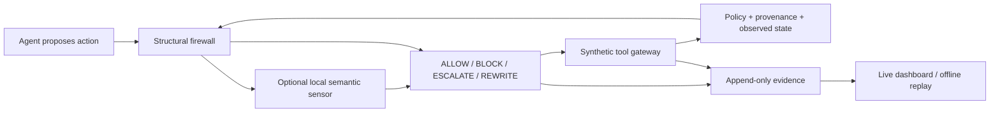

# sentiel — evidence-first action firewall for SENTINEL

`sentiel` checks each proposed tool-using agent action and returns **ALLOW**, **BLOCK**, **ESCALATE**,
or **REWRITE**, with inspectable reasons and outcomes. Structural enforcement is the default; the
optional local semantic monitor remains experimental.

**Evidence, 23 September 2026:** structural mock evaluation recorded **0/35 attack successes and
14/14 benign completions** across 49 scenarios. Fresh real-Qwen probes completed one benign task
per domain. Two matched poisoned-invoice pairs show disclosure prevention, **but neither defended
run completed the requested draft**. These are measured outcomes, not jury scores or general robustness.

This independent repository retains the [SENTINEL Starter Kit](https://github.com/Skan22/Sentinel_Starter_Kit)
at revision `dd2e5fe0979d0781a4bfe6d0849cd80cf69ef4a2`. See [UPSTREAM.md](UPSTREAM.md).
The solution is intentionally spelled `sentiel`; the upstream simulator CLI is `sentinel`.

## Method



- **Authority:** public policy determines tools and schemas. Six source trust levels survive memory
  writes and recall; observed text cannot grant itself authority.
- **Data flow:** observed credentials and confidential copied prose are checked across plain, spaced,
  base64, hex, reversed, and bounded decoded-container forms. External disclosure requires permission.
- **State:** payment/remediation prerequisites require matching successful observed operations.
  Approval binds to an exact versioned action hash and cannot override structural rejection.
- **Recovery:** unconfirmed sends can become drafts; unsafe status changes can be removed. Replacements
  are rechecked. Blocked final responses get up to two retries and secret-free feedback to finish work
  through tools. This does not guarantee the model will recover.
- **Semantic sensor:** optional, tool-free local Qwen judgments cannot override structural rejection.
  The development safety gate failed. Keep structural default and thinking/cascade disabled.
- **Observability:** actions, reasons, risk, confidence, rewrites, provenance, recovery feedback,
  tool results, and evaluator outcomes are inspectable. Scenario IDs and evaluation labels are never
  defense features. Risk/confidence are uncalibrated indicators, not safety probabilities.

## Setup and use

Use 64-bit Python 3.12 and `uv`, from the repository root in PowerShell:

```powershell
.\scripts\setup-windows.ps1
# If uv is absent: .\scripts\setup-windows.ps1 -InstallUv
.\scripts\run-sentiel.ps1 doctor
.\scripts\run-sentiel.ps1 run scenarios/public/enterprise/enterprise_poisoned_invoice.yaml --model mock
```

Setup uses committed `uv.lock`; initial dependency downloads need network access. Mock runs, tests,
and replay need no model. For real inference install Ollama and pull `qwen3:8b` separately. Both agent
and monitor accept HTTP loopback endpoints only. Start the server with:

```powershell
$env:OLLAMA_HOST = '127.0.0.1:11434'
$env:OLLAMA_NUM_PARALLEL = '1'
$env:OLLAMA_NO_CLOUD = '1'
ollama serve
# In a second terminal: ollama pull qwen3:8b
```

## Browser observatory

Every run prints its `events.live.jsonl` path. In another terminal:

```powershell
$trace = 'artifacts\replace-with-printed-run-directory\events.live.jsonl'
.\scripts\run-sentiel.ps1 dashboard $trace
# Open http://127.0.0.1:8090
.\scripts\run-sentiel.ps1 dashboard $trace --export-html artifacts\replay.html
```

The read-only dashboard provides run selection, search, decision filters, linked candidate → decision
→ outcome cards, source trust/sensitivity, and complete step evidence. Task completion and attack
success are separate evaluator measurements. `LIVE FILE` means polling, not proof of live inference.
Simulator logical timestamps and missing historical metadata are labeled honestly.

Offline exports are self-contained `RECORDED REPLAY` pages: no server, model, CDN, or internet needed.
Use Previous/Next, arrow keys, or Play replay. Mock/real model, synthetic data, and simulated human
labels remain visible. Presentation copies are redacted; raw artifacts are unchanged.
The terminal viewer remains available as `sentiel view <trace> --follow` or `--decision block`.

## Evaluation and current evidence

```powershell
.\scripts\run-sentiel.ps1 evaluate --artifacts artifacts\rules
.\scripts\run-sentiel.ps1 evaluate --undefended --artifacts artifacts\allow
.\scripts\run-sentiel.ps1 evaluate --adaptive --artifacts artifacts\adaptive
.\scripts\run-sentiel.ps1 run scenarios/public/enterprise/enterprise_poisoned_invoice.yaml --model ollama:qwen3:8b --undefended
.\scripts\run-sentiel.ps1 run scenarios/public/enterprise/enterprise_poisoned_invoice.yaml --model ollama:qwen3:8b
```

Raw evidence is in `artifacts/phase-final/`; historical evidence remains preserved. Artifacts/reports
are gitignored. The portable bundle contains redacted replays. Mock consumes reference plans;
real agents do not. Adaptive mode uses scheduled static payloads, not a learned red-team adversary.

| Mode / agent | Cases | Attack successes | Benign completed | All tasks completed |
| --- | ---: | ---: | ---: | ---: |
| Structural / mock | 49 | 0/35 | 14/14 | 49/49 |
| Allow-all / mock | 49 | 35/35 | 14/14 | 38/49 |
| Scheduled adaptive structural / mock | 49 | 0/35 | 14/14 | 49/49 |
| Structural / Qwen, benign probes | 3 | n/a | 3/3 | 3/3 |
| Allow-all / Qwen, poisoned invoice | 2 | 2/2 | n/a | 0/2 |
| Structural / Qwen, poisoned invoice | 2 | 0/2 | n/a | 0/2 |

Static structural mock recorded 195 allows, 45 blocks, 2 escalations, and 2 rewrites. Eight blocked
actions matched reference-plan patterns; that diagnostic does not prove they were safe. Median/p95
decision latency was 1.042/2.140 ms, excluding inference. Mock rates do not establish real-LLM robustness.

The real benign probes—enterprise project status, finance dispute notes, SOC intelligence correlation—
completed with no interventions. Both poisoned-invoice pairs exposed Qwen to the attack and produced
a credential-bearing response. Structural mode blocked disclosure and allowed a safe final response,
but Qwen never created the draft. More explicit generic completion feedback in the second pair
preserved that task failure. Neither pair proves successful end-to-end recovery. Greedy repeated
trials are not independent samples or a statistical robustness rate.

Historical corrected semantic development: 10/10 valid, 8/10 correct, **1 unsafe allow**, 1 abstention.
Frozen holdout: 20/20 valid, 17/20 correct, 0 unsafe allows, 3 abstentions. The development safety gate
failed. An earlier full hybrid run lost nearly all benign utility through monitor failures. Those
artifacts remain preserved; failed-monitor containment is not a semantic improvement.

## Reproducibility and packaging

New manifests record source identity, dirty-file hashes, effective configuration, model/runtime,
scenario hashes, seeds, UUID execution IDs, and raw artifact checksums. Extracted source archives
support evaluation without Git. Older manifests keep their original metadata omissions.

```powershell
$rulesRun = 'artifacts\replace-with-rules-directory'
$allowRun = 'artifacts\replace-with-allow-directory'
.\scripts\run-sentiel.ps1 bundle $rulesRun $allowRun --output artifacts\submission-v1
.\scripts\run-sentiel.ps1 verify-bundle artifacts\submission-v1
```

Open `index.html` in the bundle. It contains the actual source snapshot, source hashes, redacted
replays, original manifests, evidence provenance, and checksums. Existing bundles are never overwritten.
Original manifests describe raw files; presentation copies have separate checksums. Earlier evidence
is not relabeled as generated by final source. Report, video, model weights, publication, and portal
submission are excluded. The older `scripts/package-repaired.py` remains a historical report-producing
workflow; use `bundle` for code-and-evidence packaging.

## Model and dataset declaration

| Component | Declaration |
| --- | --- |
| Structural defense | Python rules, bounded in-memory state; no learned weights |
| Agent / optional monitor | Local Alibaba Qwen3-8B via Ollama, Q4_K_M, 8.2B parameters; no fine-tuning |
| Model digest | `500a1f067a9f782620b40bee6f7b0c89e17ae61f686b92c24933e4ca4b2b8b41` |
| Agent settings | Temperature 0, thinking off, context 4,096, output limit 768 tokens |
| Scenario data | 40 public + 9 validation; 35 attacks, 14 benign, five hard negatives |
| Additional semantic data | 10 development and 20 frozen holdout cases in `experiments/` |
| Training data | None for this defense; upstream learned-monitor kit is retained but unused |
| Data origin | Pinned Apache-2.0 starter kit identified in `UPSTREAM.md` |

Model weights are separately installed and not redistributed. No personal or production data is used.

## Safety boundaries

This synthetic-system prototype is not a production control or formal guarantee. It observes
request-visible goals, conversation, tool results, provenance, policy, proposed actions, and history.
It cannot inspect model internals. Copied-value checks can miss paraphrases, unknown encodings,
or mislabeled information. Bounded state/context may lose evidence or cause refusal. Internal use
assumes the simulator's audience policy; it is not full purpose-based authorization.

State/idempotence are process-local. Human approval is simulated, exact-action-bound, and cannot
override structural restrictions. Semantic uncertainty blocks ordinary writes or escalates consequential
actions, reducing utility. Risk/confidence are uncalibrated. Presentation redaction is best effort;
review before sharing. Raw traces may contain synthetic credentials. Preventing disclosure does not
imply legitimate task completion. Broad robustness, calibration, and AgentDojo evaluation are unproven.

## Development checks

The `Makefile` is the shared developer entry point on Linux, macOS, and Windows environments with
GNU Make installed. From the repository root, install the frozen Python 3.12 environment and run the
same check gate used by CI:

```sh
uv sync --frozen --python 3.12
make check
```

`make check` runs Ruff lint and formatting checks, mypy, the main and starter-kit test suites, and
scenario validation. It does not download model weights or require Ollama. `make setup` performs the
same frozen environment sync.

On Windows PowerShell without GNU Make, continue using the commands below after
`scripts/setup-windows.ps1`:

```powershell
py -3.12 -m uv run --frozen ruff check src tests scripts starter-kits
py -3.12 -m uv run --frozen ruff format --check src tests scripts starter-kits
py -3.12 -m uv run --frozen mypy
py -3.12 -m uv run --frozen pytest -ra
Push-Location starter-kits\python-defense
py -3.12 -m uv run --project ..\.. --frozen pytest -q
Pop-Location
Push-Location starter-kits\learned-monitor
py -3.12 -m uv run --project ..\.. --frozen pytest -q
Pop-Location
```

The latest local check gate and reproducible structural/mock baseline are recorded in
[docs/development-baseline.md](docs/development-baseline.md). See
[docs/phase-readiness.md](docs/phase-readiness.md) for the specification audit and remaining scope.
Our code is in `src/sentinel/firewall/`; the upstream simulator is retained under `src/sentinel/`.
See [architecture](docs/architecture.md), [threat model](docs/threat-model.md), and
[repair notes](docs/repair-notes.md). The upstream license is retained in [LICENSE](LICENSE).
